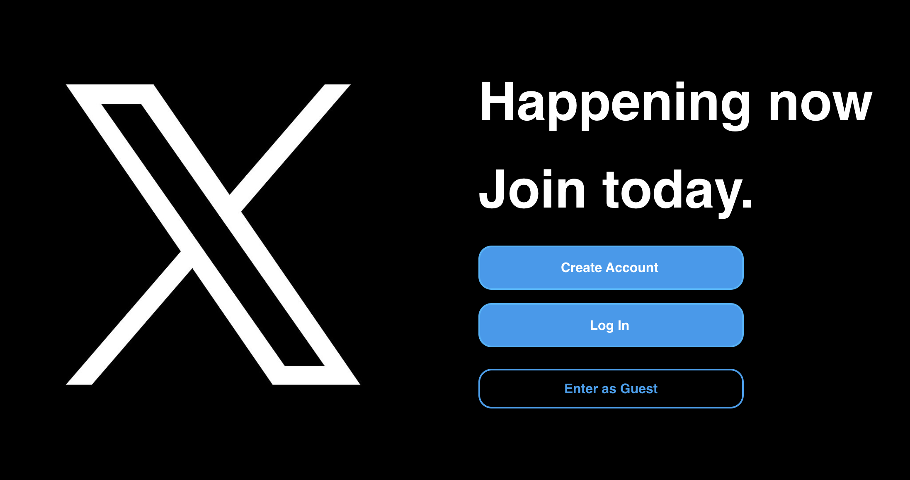

<h1 align="center">Welcome to X-Clone 👋</h1>
<!-- <p>
  <a href="https://twitter.com/Healer2Hacker" target="_blank">
    
  </a>
  <a href="https://twitter.com/Healer2Hacker" target="_blank">
    
  </a>
</p> -->

<h1>About the Project</h1>

<p>Full-Stack Social Media Clone featuring pixel perfect, mobile responsive rendition of X (formerly known as Twitter). 
  
Features:
1. Users can post, comment
2. Users can like other posts, and like other comments
3. Users can post deeply nested comments--this required recursion to implement. Simulating the actual X platform
4. Users can follow and unfollow other users, and edit their profile
5. Playwright was utilized for end-to-end testing as well as React Testing Library to test all essential features.</p>

### 🏠 [Homepage]


<br></br>
<br></br>


### Mobile Responsive


## Install

```sh
git clone git@github.com:jwaddell10/X-Clone.git
npm install
npm run dev
```

## Author

👤 **Jonathan Waddell**

* Twitter: [@Healer2Hacker](https://twitter.com/Healer2Hacker)
* Github: [@jwaddell10](https://github.com/jwaddell10)

## Show your support

Give a ⭐️ if this project helped you!

***
_This README was generated with ❤️ by [readme-md-generator](https://github.com/kefranabg/readme-md-generator)_

Give a ⭐️ if this project helped you!

***
_This README was generated with ❤️ by [readme-md-generator](https://github.com/kefranabg/readme-md-generator)_
